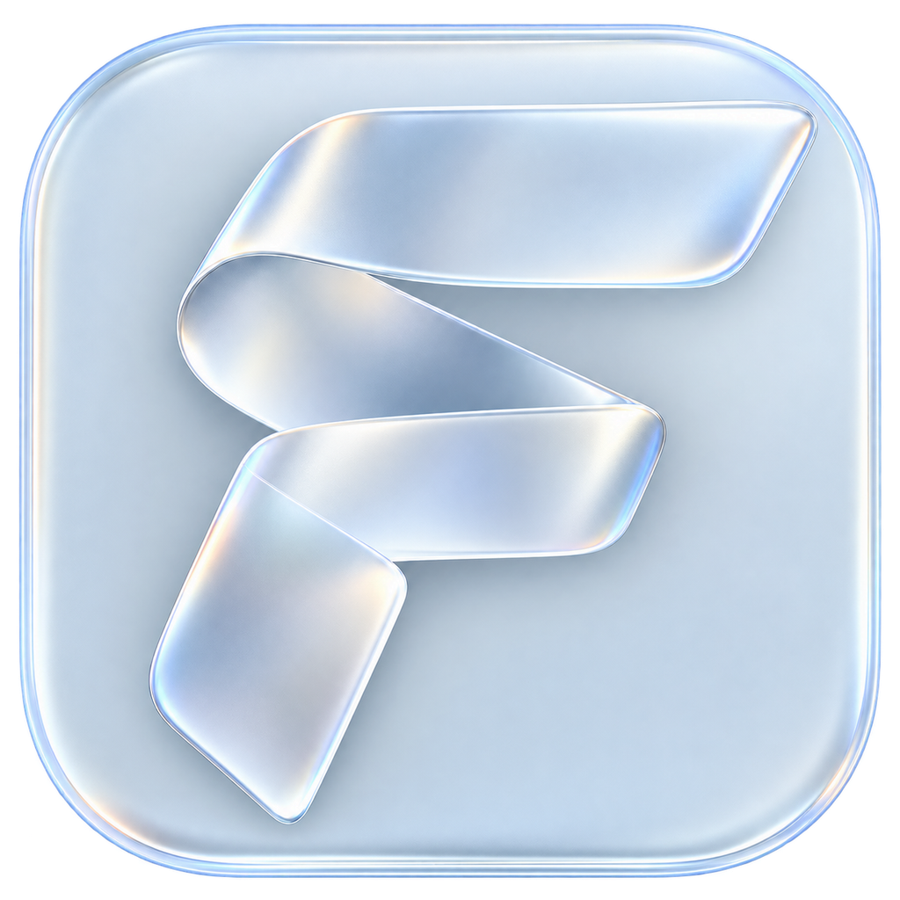

# Foundry



**把想法、资料和 AI 协作，放进一个轻盈的产品工作台。**

Foundry 是面向产品经理的桌面 AI 工作台，围绕需求梳理、文档协作、项目资料和模型对比组织日常工作。界面采用紧凑的助手入口、以输入为中心的布局，以及受 Liquid Glass 启发的半透明材质。

由 [@17lijunyi](https://github.com/17lijunyi) 主导 Foundry 的产品设计、定制开发与维护，完成品牌、玻璃界面、交互动效、角色头像与桌面窗口体验等改造。开发基础与署名范围见[来源、许可与反馈](#来源许可与反馈)和[作者说明](docs/AUTHORS.md)。

> 当前提供源码，尚未提供 Foundry 的公开 Releases 安装包。下方是源码启动与本地构建方法；上游 AionUi 的安装包不会包含本仓库的定制内容。

## 可以做什么

- **需求与文档协作**：在会话中梳理想法、组织 PRD，结合本地文件和项目文件夹与助手协作。
- **助手与模型配置**：保留助手、模型服务、团队和定时任务等既有入口。外部模型服务和 CLI 助手需要自行配置、安装或登录。
- **模型对比台**：用相同提示词和材料比较 2～4 个模型，查看独立流式回答、状态与耗时，支持停止、重试和保存对比记录。
- **文件预览与修改**：打开对话中的文件，在支持编辑的预览中检查修改前后内容，再确认保存；撤回会恢复为待保存草稿，不会静默覆盖磁盘文件。
- **统一桌面体验**：Foundry 名称与折带 F 图标、紧凑助手图标、浮动导航和输入区，覆盖工作空间、会话、设置与模型对比页面。
- **助手视觉与头像选择**：Agent 入口使用统一的单色品牌图标；21 个官方助手使用与任务相关的像素角色头像，自定义助手也可从这套头像中选择。
- **macOS 窗口操作**：绿色按钮在当前桌面放大或还原窗口，保留普通窗口的使用方式。

模型对比的协议、材料大小和记录限制见[模型对比台说明](AionUi/docs/guides/model-bench.zh-CN.md)。模型调用由所配置的服务提供，源码不附带账号、密钥或免费额度。

## 十种交互动效

动效跟随真实操作与状态变化，保留系统“减少动态效果”偏好。玻璃用于界面材质，不加入整页玻璃转场。

| 动效       | 对应操作                                                 |
| ---------- | -------------------------------------------------------- |
| 助手就位   | 切换助手时，紧凑图标与输入区选择状态呼应                 |
| 提示词接力 | 快捷提示词进入可编辑的输入草稿                           |
| 资料归位   | 已添加的文件进入附件区域                                 |
| 命令开扇   | 打开斜杠菜单，命令分序出现并跟随键盘选择                 |
| 消息交接   | 后端确认的新用户消息进入会话，不重播历史消息             |
| 思考折页   | 思考或工具步骤完成后折叠，保留手动展开；失败步骤保持可见 |
| 草稿排队   | 草稿进入队尾，保留待发送内容与队列操作                   |
| 模型并行   | 各模型独立呈现运行与完成状态                             |
| 改写对照   | 展示真实编辑差异，确认采纳并支持恢复草稿                 |
| 产物落桌   | 点击文件卡或链接后，与右侧预览产生短距离呼应             |

## 从源码启动

### 环境要求

- Git、Node.js **22～24**、Bun、Python 3 和平台 C/C++ 构建工具。
- Rust / Cargo；[工具链文件](AionCore/rust-toolchain.toml)固定为 **Rust 1.95.0**，使用 rustup 时会按项目配置选择工具链。
- macOS 构建原生玻璃模块需要 **macOS 26 SDK**、Xcode 命令行工具和 Node-API 头文件。使用包含头文件的 Node 安装；自定义安装可通过 `AIONUI_NODE_HEADERS` 指向含 `node_api.h` 的目录。
- 首次安装依赖、准备运行资源和打包需要联网。

目前主要验证环境为 **macOS / Apple Silicon**。Windows、Linux 和 Intel Mac 的 Foundry 分发包尚未验证；以下命令使用 macOS 的 zsh/bash。其他平台的基础环境说明见[上游开发指南](AionUi/docs/contributing/development.md)，以本仓库实际脚本为准。

### 克隆并运行

```sh
git clone https://github.com/17lijunyi/Foundry.git
cd Foundry
```

从仓库根目录执行：

```sh
foundry_root="$PWD"

# 构建本仓库的后端，保留模型对比等定制功能。
(
  cd AionCore
  cargo build --locked --release -p aionui-app --bin aioncore
)

# 安装桌面端依赖，并明确使用刚刚编译的后端。
(
  cd AionUi
  bun install --frozen-lockfile
  AIONUI_BACKEND_BIN="$foundry_root/AionCore/target/release/aioncore" bun run start
)
```

桌面端会自行启动后端，无需另开服务进程。修改 Rust 代码后重新执行后端构建并重启桌面端；仅刷新前端不会载入后端改动。

依赖安装会调用原生模块构建。如果安装日志显示 `Postinstall failed`，先修复 C/C++ / Python 构建环境，再在 `AionUi` 内执行 `bunx electron-builder install-app-deps`。

## 本地打包 macOS Apple Silicon 应用

先完成上述依赖安装与后端构建，然后从仓库根目录执行。这里显式准备本仓库的后端资源包，避免打包脚本默认下载上游后端。

```sh
foundry_root="$PWD"
foundry_bundle="$foundry_root/AionCore/target/foundry-bundle"

mkdir -p "$foundry_bundle"
cp AionCore/target/release/aioncore "$foundry_bundle/aioncore"

# 准备所需的托管 Node 运行资源；使用独立的构建数据目录。
"$foundry_bundle/aioncore" \
  --data-dir "$foundry_root/AionCore/target/foundry-prepare" \
  prepare-managed-resources \
  --bundle-out "$foundry_bundle/managed-resources"

(
  cd AionUi
  AIONUI_BACKEND_LOCAL_BUNDLE_DIR="$foundry_bundle" \
  CSC_IDENTITY_AUTO_DISCOVERY=false \
  bun run build-mac:arm64
)
```

产物写入 `AionUi/out/`。这是本地构建命令，未配置 Developer ID 签名和 Apple 公证，也不会自动发布到 GitHub。公开分发前需自行配置签名、公证并验证安装流程。只运行 `bun run package` 会生成主进程、预加载和前端代码，不会生成完整安装包。

原生玻璃在 **macOS 26** 使用 `NSGlassEffectView`；较早系统运行时使用 `NSVisualEffectView`。模块加载失败时保留 CSS 半透明界面，其他平台使用浏览器玻璃主题。编译 macOS 模块仍需上述 SDK。实现与限制见[原生玻璃说明](AionUi/packages/desktop/native/README.md)。

## 检查与项目结构

```sh
# 从仓库根目录执行桌面端检查。
(
  cd AionUi
  bun run i18n:types
  node scripts/check-i18n.js
  bunx tsc --noEmit
  bun run test
)
```

本分支曾在 macOS Apple Silicon 完成本地构建与运行验证；开源整理不等于在所有平台、全新依赖环境和全部模型服务上完成验收。上述步骤按当前源码入口核对，首次完整构建仍取决于依赖下载和本机工具链。

```text
Foundry/
├── AionUi/       # Electron、React / TypeScript 前端和桌面集成
├── AionCore/     # Rust 后端、接口、会话与运行资源
├── docs/         # Foundry 与前代产品的作者说明、修改记录
├── LICENSE      # 保留的 Apache 2.0 许可证
└── NOTICE       # Foundry 与上游来源、版权说明
```

请保留两个子目录的同级关系。仓库不包含依赖目录、编译产物、聊天记录或个人凭据。开发版使用独立开发配置目录；正式版保留“产品经理工作台”的数据目录名称及既有应用标识，以兼容原有本地数据。备份和排查时不要仅按 Foundry 显示名称判断数据位置。

## 来源、许可与反馈

Foundry 的品牌、界面和交互动效改造基于以下项目继续开发：

1. [产品经理工作台 / 周承健](https://github.com/Zhouchengjian-user/product-manager-workbench)：前代产品定位、模型对比、项目文件夹和中文体验等定制。
2. [AionUi](https://github.com/iOfficeAI/AionUi) 与 [AionCore](https://github.com/iOfficeAI/AionCore)：桌面架构、后端与通用助手、会话、团队、定时任务等基础能力。

原版权声明与 Apache-2.0 许可证文本保持保留。Foundry 自有新增及修改部分沿用 Apache-2.0；第三方代码、素材和商标仍遵循各自声明，不表示获得上游官方背书。详见 [LICENSE](LICENSE)、[NOTICE](NOTICE)、[AionUi/LICENSE](AionUi/LICENSE) 和 [AionCore/LICENSE](AionCore/LICENSE)。AionCore 原有 Cargo 元数据标记为 MIT，与其随附 Apache-2.0 许可证文本存在差异；本分支未据此重写上游授权声明。

[修改记录](docs/MODIFICATIONS.md)与[作者说明](docs/AUTHORS.md)同时记录 Foundry 的改造和前代产品的历史来源。`FILES.sha256` 仅保留最初源码快照的校验值，不代表当前 Foundry 版本。

问题与建议请提交至 [Foundry Issues](https://github.com/17lijunyi/Foundry/issues)。请说明系统、架构、复现步骤和使用的助手或模型接口，并移除密钥及私人会话内容。
